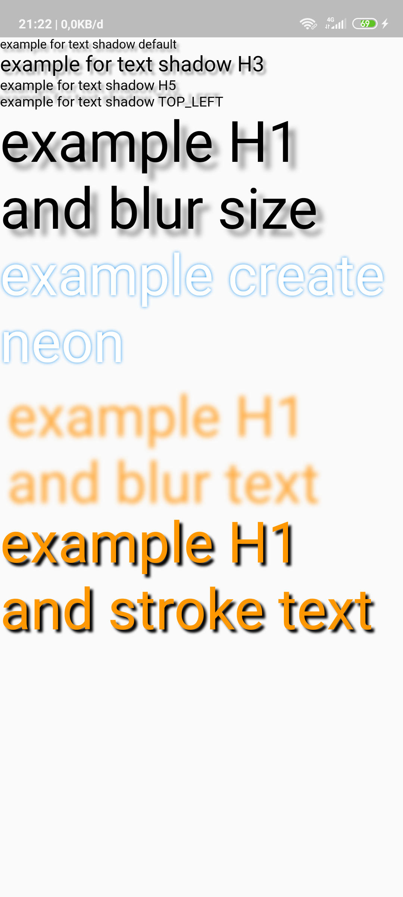

# text_shadow

simple shadow text

## Getting Started

import: 
``` dart
import 'package:text_shadow/text_shadow.dart';
```

use :

```dart
class MyApp extends StatelessWidget{
  @override
  Widget build(BuildContext context) {
    return Container(
      child: MaterialApp(
        debugShowCheckedModeBanner: false,
        home: Scaffold(
          body: SafeArea(
            child: Center(
              child: ListView(
                children: [
                  // just add .shadow() behind of text widget and run it 
                  Text("example for text shadow default").shadow(),
                  Text("example for text shadow H3").shadow(
                    fontSize: FontSize.H3
                  ),
                  Text("example for text shadow H5").shadow(
                    fontSize: FontSize.H5
                  ),
                  Text("example for text shadow TOP_LEFT").shadow(
                    fontSize: FontSize.H5,
                    align: ShadowAlign.TOP_LEFT
                  ),
                  Text("example H1 and blur size").shadow(
                    fontSize: FontSize.H1,
                    blurZize: BlurSize.LARGE
                  ),
                  Text("example create neon",).shadow(
                    textColor: Colors.white,
                    shadowColor: Colors.blue,
                    align: ShadowAlign.CENTER,
                    fontSize: FontSize.H1,
                    blurZize: BlurSize.MEDIUM
                  ),
                  Text("example H1 and blur text").shadow(
                    fontSize: FontSize.H1,
                    blurZize: BlurSize.LARGE,
                    shadowColor: Colors.orangeAccent,
                    textColor: Colors.transparent
                  ),
                  Text("example H1 and stroke text").shadow(
                    fontSize: FontSize.H1,
                    blurZize: BlurSize.SMALL,
                    shadowColor: Colors.black,
                    textColor: Colors.orange
                  ),
                ],
              )
            ),
          ),
        ),
      ),
    );
  }
}
```

options :

ShadowAlign. 
```dart
TOP_LEFT,
TOP_CENTER,
TOP_RIGHT,
CENTER_RIGHT,
BOTTOM_RIGHT,
BOTTOM_CENTER,
BOTTOM_LEFT,
CENTER_LEFT,
CENTER
```

BlurSize.
```dart
EXTRA_SMALL,
SMALL,
MEDIUM,
LARGE,
EXTRA_LARGE
```
FontSize.
```dart
H1,
H2,
H3,
H4,
H5,
H6
```





